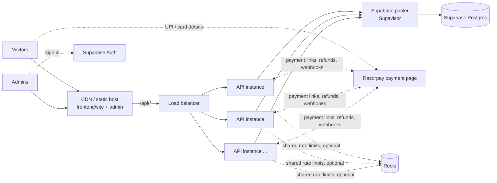

# GROWND

The GROWND science-experience website, its booking and payments API, and the admin dashboard the team uses to manage registrations, payments, prices and dates.

```
frontend/          the website; `npm run build` turns it into dist/, served from a CDN
  design/          the site's source: every page, its logic and the mission data
  seo.mjs          titles, descriptions, share images and structured data for each page
  build.mjs        builds dist/: one HTML file per page, hashed assets, sitemap, robots.txt
  site/            the booking/payment page (checkout.html)
  admin/           admin dashboard (plain HTML/CSS/JS, Supabase Auth sign-in)
backend/           API: Node + Fastify, stateless, talks to Supabase Postgres and Razorpay
  src/
    routes/        HTTP layer: public, payments, admin, cron, health. Validation and status codes only
    services/      business logic; all SQL lives here (orders.js holds the payment rules)
    payments/      the only code that knows about Razorpay, behind a small provider-neutral interface
    lib/           cache, errors, money, validation helpers
    app.js         plugins, protection, error handling
    server.js      start-up, payment reconciliation, graceful shutdown (long-running servers)
    index.js       entry point; optional multi-core worker supervisor
  scripts/         check (setup checker), db:migrate, create-admin
  Dockerfile       for container hosts (not needed on Vercel)
database/
  migrations/      SQL schema for Supabase, applied in order
api/index.js       Vercel Function: runs the backend for /api/* on Vercel
vercel.json        Vercel: builds the site, serves dist/ from the CDN, the function for /api/*, daily cron
package.json       npm workspace root: `npm install` here installs the backend too
```

Each folder has its own README with the details. **New here? Start with [SETUP.md](SETUP.md).** Search engine setup, Search Console and the backlink plan are in [SEO.md](SEO.md).

## How it fits together



- **Visitors** load static pages from a CDN: one HTML file per page (`/missions/slime-chemistry`, `/quiz`, ...) with its own title, description and share image, so search engines and link previews see every page. The site calls `GET /api/content` (prices, dates, site details), `POST /api/registrations` (register interest) and the checkout endpoints.
- **Payments** happen on Razorpay's hosted payment page (UPI, cards, netbanking, wallets), so card and UPI details never touch GROWND's servers. Razorpay tells the API what happened through signed webhooks.
- **Admins** sign in with Supabase Auth in the dashboard. The API verifies the token on every request and requires `app_metadata.role = "admin"`.
- **The database** is only reachable through the API. Row Level Security blocks Supabase's auto-generated REST API for these tables.

## Payments

There are two ways customers pay, and both go through the website:

1. **Book a date.** On a mission page, **Book this date** opens `checkout.html`. The customer enters their details and the number of children, then pays on Razorpay. Their places are **held for 30 minutes** while they pay. If they cancel or time runs out, the places go straight back.
2. **Payment links (quotes).** For parties and school visits, an admin opens the registration in the dashboard, enters the agreed amount and creates a link to copy or email. When the customer pays it, the registration is marked **confirmed** automatically.

The dashboard's **Payments** page lists everything with totals. You can refund in full there (any held places are freed) or cancel unpaid orders. Each date in **Missions & dates** shows how many places are booked. Razorpay emails the receipts.

How it stays correct under pressure:

| Risk | What prevents it |
| --- | --- |
| Overselling a popular date | Places are taken in the same database statement that checks they exist. In a test, 200 people tried for 10 places at once: exactly 10 got them, and 190 were told it sold out. |
| Paying but not being recorded | Razorpay's signed webhook is the source of truth. If it is late, the confirmation page asks Razorpay directly. If it never arrives, a background reconciler settles overdue orders with Razorpay. |
| Webhooks delivered twice or out of order | Every event is recorded in the same transaction as its effect, and status changes are guarded, so repeats change nothing. |
| A customer paying twice (link open in two tabs) | The second payment is detected and refunded automatically. |
| Places never coming back | Each order records how many places it holds, and gives them back exactly once (cancel, expiry, failure or refund). |
| Razorpay slow or down | Calls time out after 10 s with safe retries (each payment link has a unique reference, so a retry never makes a second one). If a checkout cannot start, the order is discarded and its places freed. A per-process cap answers "busy, try again" instead of piling up. |
| Forged webhooks | Rejected by signature check. |

### Set up Razorpay

[SETUP.md](SETUP.md), Parts 2 to 4, walks through it: test keys, a test booking with a test UPI ID or card, the webhook on the deployed site, and going live after Razorpay's account activation.

Locally, the keys alone are enough to take test payments: a payment is recorded the moment the customer returns to the site. In production the API refuses to take payments until signed webhooks are configured too.

`npm test` runs the payment tests (booking, paying, duplicate and forged webhooks, cancelling, expiry, refunds, Razorpay being down) against a local Postgres and a stand-in for Razorpay. Set `TEST_DATABASE_URL` to a Postgres it may wipe.

## Built for traffic spikes

| Concern | What the system does |
| --- | --- |
| Lots of visitors | The site is static on a CDN. `/api/content` is built once per 30 s per instance, kept as a ready-made JSON string, and shared by concurrent requests (no stampede on a cold cache). It also sends CDN cache headers, so the CDN absorbs most traffic. Database load stays flat however many people visit. |
| Lots of sign-ups at once | **Group commit:** sign-ups arriving within 5 ms of each other are saved in one multi-row INSERT. A spike costs dozens of database round trips instead of thousands. If the database rejects one row, the rest of its batch is still saved. |
| A rush for one date | Place holds are single conditional UPDATEs on one row. Once a date is full, further attempts fail fast without waiting on Razorpay. |
| More traffic than one machine | API instances are stateless; add more behind a load balancer. On a VM, `WEB_CONCURRENCY` runs one worker per CPU core and restarts any that die. |
| Database connections | Each process keeps a small pool (`DB_POOL_MAX`) through Supabase's pooler, so many instances share a bounded number of real Postgres connections. |
| Overload | Instead of crashing, the API answers `503` with `Retry-After`: when the event loop or memory is saturated, when too many sign-ups or checkouts are queued in a process, or when a query can't finish within 5 s. |
| Abuse | Per-IP rate limits: 30 sign-ups and 30 checkouts per hour, 1,200 content reads/minute, 300 other API calls/minute; Razorpay webhooks are never throttled. With several instances, set `REDIS_URL` so they share counters. If Redis goes down, requests are allowed rather than blocked. |
| Operations | `/healthz` (liveness, still answers under load) and `/readyz` (checks the database). Graceful shutdown drains requests on deploy. Structured JSON logs record only slow and failed requests. |
| Security | Strict input validation with friendly messages; small body limits; no secrets in the browser; Bearer tokens verified locally against Supabase's signing keys; signed webhooks; unguessable order links that never expose phone numbers or notes; CSV export defused against spreadsheet formulas; Content-Security-Policy on the dashboard and checkout. |

### Measured

These are from **one Node process on a laptop** against a local Postgres 18, driven by autocannon from thousands of simulated client IPs. Payment tests used a stand-in for the payment provider that signs webhooks like the real one.

| Test | Result |
| --- | --- |
| `GET /api/content`, 500 concurrent visitors, 20 s | 22,400 req/s, p99 46 ms, 0 errors |
| `POST /api/registrations`, 300 concurrent sign-ups, 15 s | 14,700 saved per second, p99 66 ms, 0 errors; every acknowledged row present in the database, no duplicates |
| `POST /api/checkout`, 300 concurrent buyers on a 999-place date, 10 s | about 1,480 attempts/s, 0 errors; every place sold exactly once (0 left + 999 held = 999) |
| 200 people at once for 10 places | 10 booked, 190 told "sold out", none oversold |
| One IP hammering the form | throttled with 429 in 2 ms; server stayed healthy |

On that basis, one million visitors loading the site is mostly CDN traffic, and the API side is a handful of instances. Real checkout throughput is also bounded by Razorpay's API rate limits, so talk to Razorpay before a very large launch. Production numbers depend on your Supabase compute size and pooler connection limit; load-test your real setup before a big launch.

## Run it locally

You need Node 22+ and a Supabase project (the free tier is fine). Razorpay is optional at first: without its keys the site simply takes registrations of interest.

**[SETUP.md](SETUP.md)** walks through creating the Supabase project and Razorpay account and filling in `backend/.env`. In short, from this folder:

```bash
npm install
npm run check                            # checks backend/.env and every service, says what to fix
npm run db:migrate                       # creates the tables
npm run create-admin -- you@example.com --keep  # makes a Supabase user an admin (SETUP.md, step 6)
npm run dev                              # builds the site, then starts the API
```

Then open http://localhost:4000 for the site and http://localhost:4000/admin/ for the dashboard. After editing anything in `frontend/`, run `npm run build` and refresh; `npm run check:site` checks the build for SEO problems.

## Deploy

**On Vercel** (the setup used for grownd-beige.vercel.app): set the project's Root Directory to this folder, add the environment variables and deploy. [SETUP.md](SETUP.md), Part 3, lists every setting.

`vercel.json` makes Vercel run `npm run build` and serve `dist/` from its CDN with clean addresses, and one Vercel Function (`api/index.js`) run the backend for `/api/*` with Fluid compute. A daily Vercel Cron job calls `/api/cron/reconcile`, because serverless has no long-running timer. The API's caching headers let the CDN answer `/api/content` too. Set `REDIS_URL` (Upstash) so rate limits are shared across instances.

**On a container host** (Render, Railway, Fly.io, Cloud Run, ECS):
1. Build from this folder: `docker build -f backend/Dockerfile .`
2. Set the variables from `backend/.env.example`, plus `NODE_ENV=production` and `TRUST_PROXY=1`.
3. Use `/readyz` as the health check, autoscale on CPU, and add `REDIS_URL` once you run more than one instance.
4. Run `npm run build` (with `SITE_URL` set to your address) and host `dist/` on a CDN that forwards `/api/*` to the API (see `frontend/README.md`).

Either way, run `npm run db:migrate` against Supabase from your computer, and point the Razorpay webhook at `https://YOUR-SITE/api/payments/webhook` (SETUP.md, Part 3).

## Before launch

- Fill in prices, dates and site details in the dashboard. The overview's **Before launch** panel lists what is missing.
- Switch Razorpay to live keys and a live webhook only after a full test-mode run-through.
- Publish booking terms, a privacy policy and a cancellation and refund policy, and link them from the site. Razorpay asks for them during account activation.
- Check with an accountant whether prices need GST shown or added. Tax is not calculated yet.
- Edit the copy placeholders the dashboard does not manage, listed in `frontend/README.md`.
- New registrations and bookings show up in the dashboard, and Razorpay emails customers their receipts, but the GROWND team is not emailed about them yet. That is the next feature worth adding.
